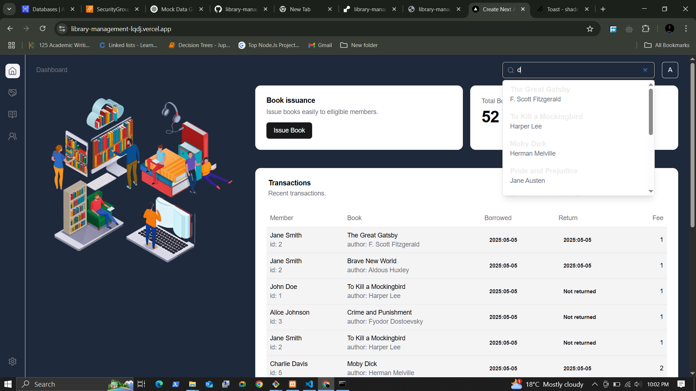
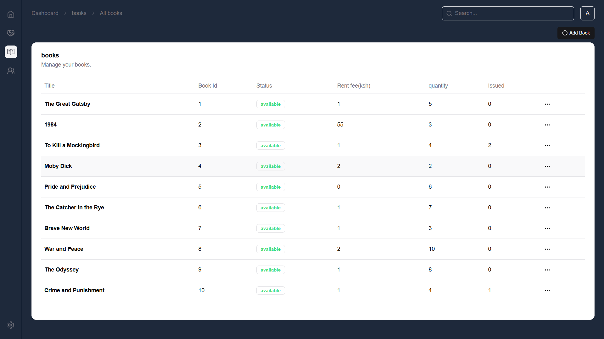
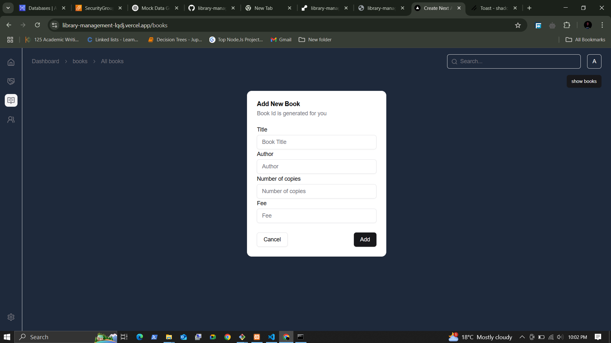
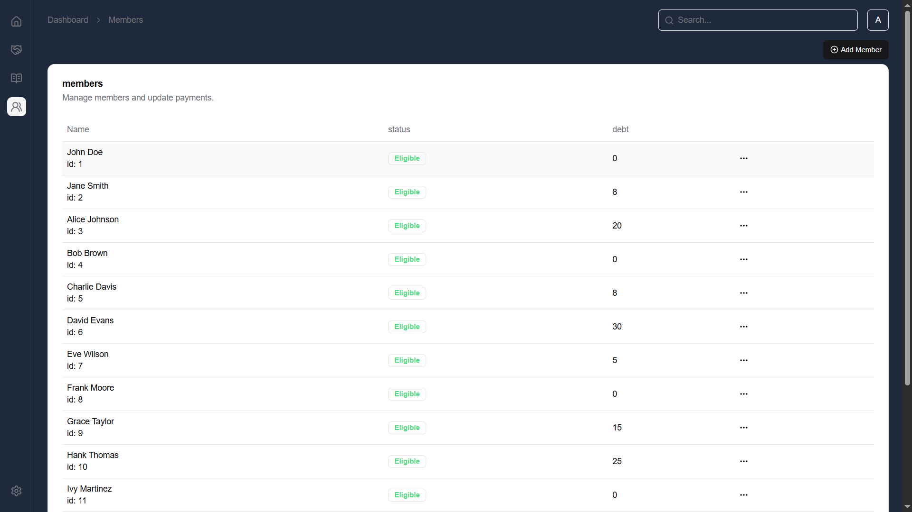
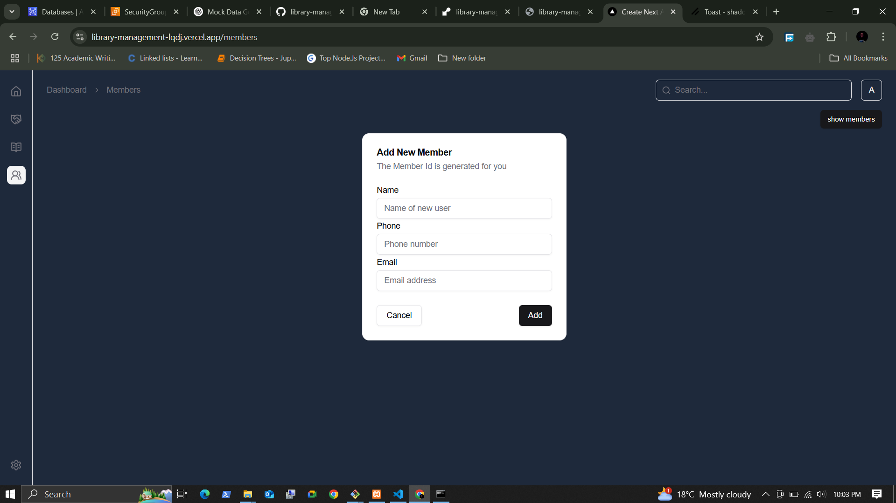
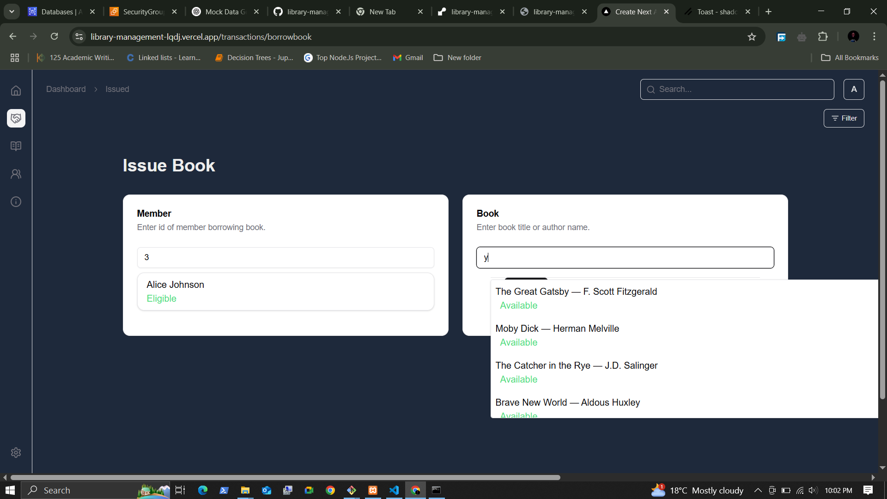
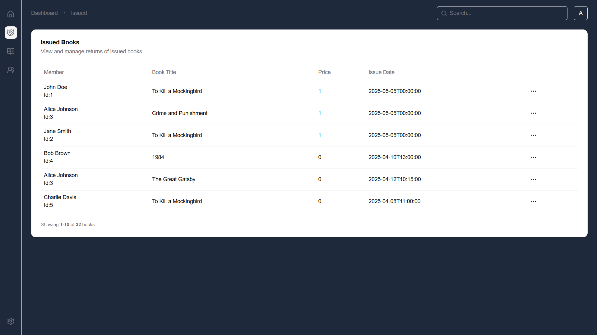
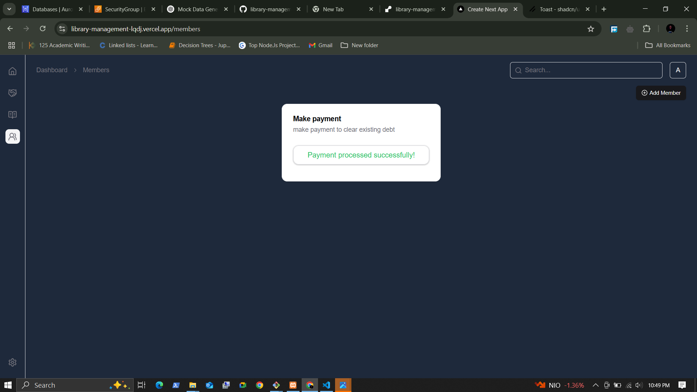
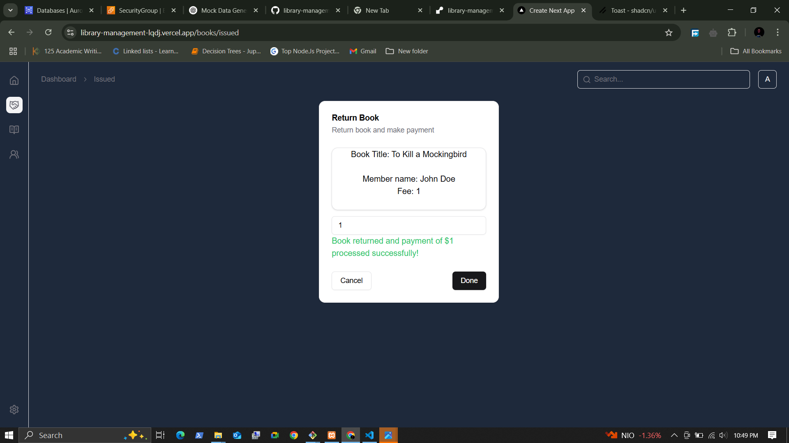

# Library Management System

This project is a full-stack Library Management System consisting of a **frontend** built with Next.js and a **backend** built with Flask. It allows managing books, members, and transactions such as borrowing and returning books.

---

## Table of Contents 

- [Project Overview](#project-overview)  
- [Folder Structure](#folder-structure)  
- [Frontend](#frontend)  
  - [Overview](#overview)  
  - [Technologies](#technologies)  
  - [Setup and Running](#setup-and-running)  
  - [Available Scripts](#available-scripts)  
- [Backend](#backend)  
  - [Overview](#overview-1)  
  - [Technologies](#technologies-1)  
  - [Setup and Running](#setup-and-running-1)  
- [Running the Application](#running-the-application)  
- [Testing](#testing)  
- [Deployment](#deployment)  
- [Screenshots](#screenshots)  
- [Contributing](#contributing)  
- [License](#license)  

---

## Project Overview

This Library Management System provides a web interface to manage books, members, and transactions such as borrowing, returning, and payments. The frontend is a modern React-based Next.js application with a responsive UI, while the backend is a RESTful API built with Flask, handling business logic and database operations.

---

## Folder Structure

```
/frontend    # Next.js frontend application
/backend     # Flask backend API server
```

---

## Frontend

### Overview

The frontend is built with [Next.js](https://nextjs.org/) using React and TypeScript. It features a dashboard for managing books, members, and transactions. The UI uses [Tailwind CSS](https://tailwindcss.com/) for styling and [Radix UI](https://www.radix-ui.com/) components for accessible UI primitives. Axios is used for API communication with the backend.

### Technologies

- Next.js (React framework)  
- TypeScript  
- Tailwind CSS  
- Radix UI components  
- Axios for HTTP requests  
- Lucide React icons  

### Setup and Running

1. Install dependencies:

```bash
cd frontend
npm install
```

2. Run the development server:

```bash
npm run dev
```

3. Open [http://localhost:3000](http://localhost:3000) in your browser.

### Available Scripts

- `npm run dev` - Runs the app in development mode.  
- `npm run build` - Builds the app for production.  
- `npm run start` - Starts the production server.  
- `npm run lint` - Runs ESLint for code linting.  
- `npm run deploy` - Builds the app and copies the output to the backend static folder.

---

## Backend

### Overview

The backend is a RESTful API built with [Flask](https://flask.palletsprojects.com/) in Python. It manages data persistence, authentication, and business logic for the library system. The backend connects to a database using SQLAlchemy ORM and supports migrations with Alembic.

### Technologies

- Python 3  
- Flask  
- Flask-CORS  
- Flask-Login  
- Flask-Migrate  
- Flask-SQLAlchemy  
- PyMySQL (MySQL database driver)  
- Alembic (database migrations)  
- pytest (testing)  

### Setup and Running

1. Create and activate a Python virtual environment.

2. Install dependencies:

```bash
cd backend
pip install -r requirements.txt
```

3. Run the backend server:

```bash
python run.py
```

The backend server will start on [http://localhost:5000](http://localhost:5000).

---

## Running the Application

To run the full application locally:

1. Start the backend server:

```bash
cd backend
python run.py
```

2. Start the frontend development server:

```bash
cd frontend
npm run dev
```

3. Access the frontend at [http://localhost:3000](http://localhost:3000).

---

## Testing

- Backend tests use `pytest`. Run tests from the `backend` folder:

```bash
pytest
```

- Frontend tests use Jest and React Testing Library. Run tests from the `frontend` folder:

```bash
npm test
```

---

## Deployment

Both the frontend and backend are deployed independently during production, the backend on render.com and frontend on vercel,
The database is hosted on aws(rds).

---

## Screenshots


*Library Management System Homepage*


*Books management page showing list of books*


*Form to add a new book*


*Members management page*


*Form to add a new member*


*Issue book to a member*


*List of currently issued books*


*Make payment to reduce member debt*


*Return a borrowed book*


*Library image*

---


## Contributing

Contributions are welcome! Please open issues or submit pull requests for improvements or bug fixes.

---

## License

This project is licensed under the MIT License.
